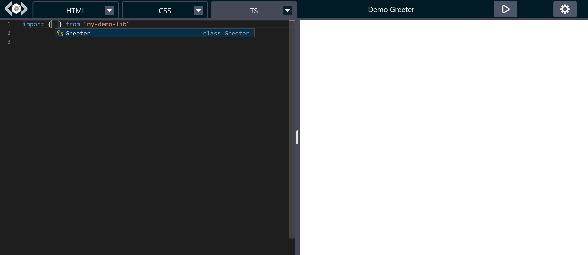
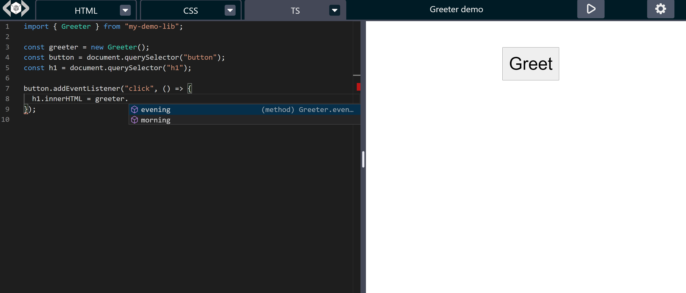
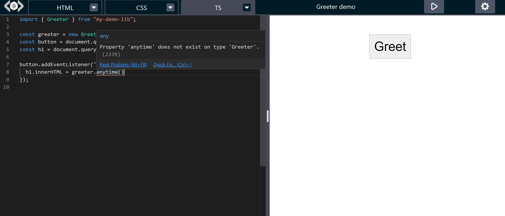
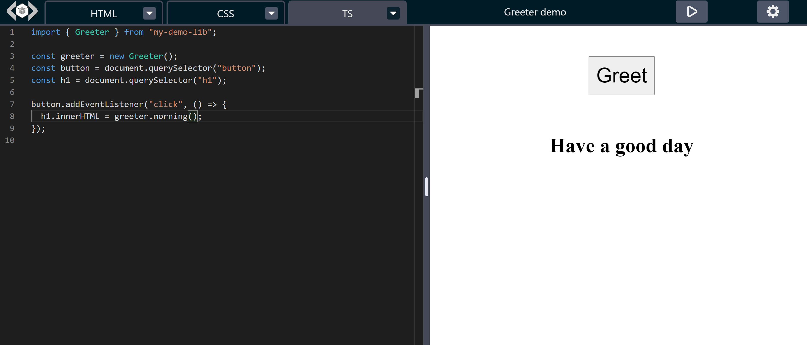

# Screenshots for typing support for locally defined modules

[read this for details](https://github.com/hatemhosny/localpen#importing-local-modules-with-typescript-types)

### Import the module

### Identified class methods

### Error for non-existing method

### The module actually works

